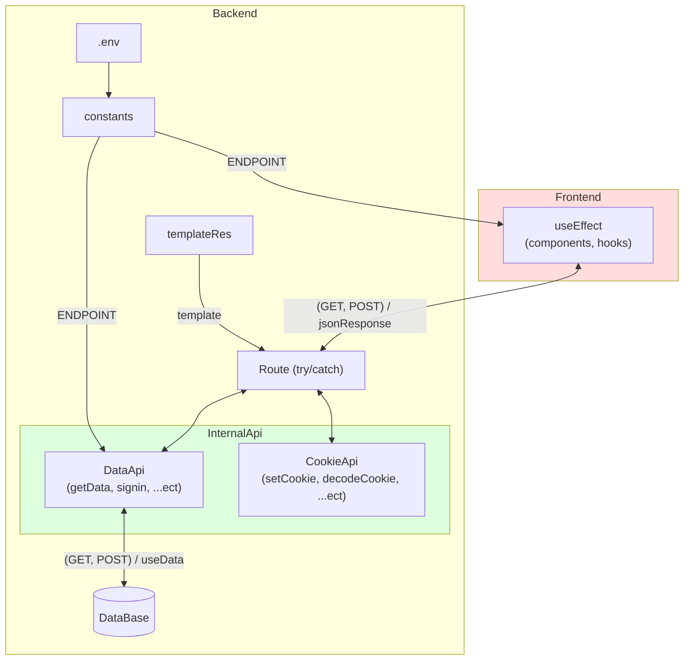

# architecture

```mermaid
graph TD
    subgraph Frontend
        A1["useEffect<br>(components, hooks)"]
    end
    subgraph Backend
        B1["Route (try/catch)"]
        B2[templateRes]
        subgraph InternalApi
            C1["DataApi<br>(getData, signin, ...ect)"]
            C2["CookieApi<br>(setCookie, decodeCookie, ...ect)"]
        end
        D1[(DataBase)]
        E1[constants]
        E2[.env]
    end

    A1<-->|"(GET, POST) / jsonResponse"|B1
    B1<-->C1
    B1<-->C2
    B2-->|template|B1
    C1<-->|"(GET, POST) / useData"|D1
    E1-->|ENDPOINT|A1
    E1-->|ENDPOINT|C1
    E2-->E1

    style Frontend fill:#fdd
    style InternalApi fill:#dfd
```
